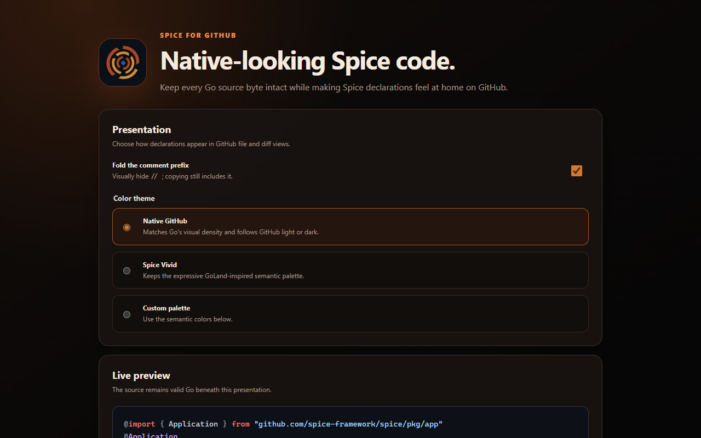
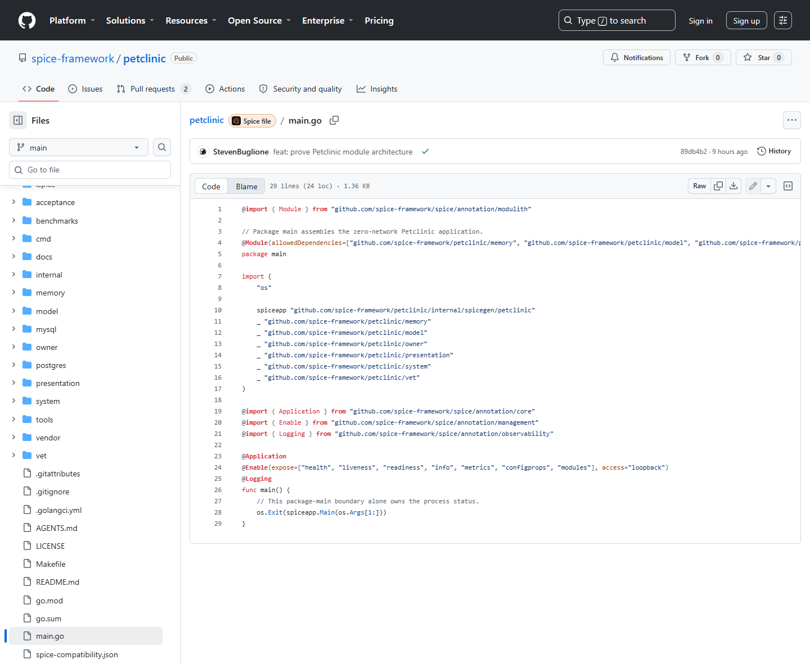

# Spice for GitHub

Unified documentation: [spiceframework.dev/tools/github-extension](https://spiceframework.dev/tools/github-extension/).

Spice for GitHub makes valid [Spice](https://github.com/spice-framework/spice) declaration comments read like native language annotations on GitHub. It visually folds the `// ` prefix, restores semantic syntax highlighting, and adds an icon-only Spice link beside GitHub's file actions for every detected Spice file.

The source is never rewritten. Copying a declaration still produces valid Go such as `// @Application`, raw views stay unchanged, and GitHub's own review data remains authoritative.

The browser-neutral parser and semantic palettes live in [`packages/spice-syntax`](packages/spice-syntax). The extension build packages those exact sources, while documentation tooling can use the ESM entry without maintaining a second parser. A shared JSON corpus locks token and concealment behavior across consumers.





## What it does

- Recognizes only canonical declaration comments beginning with exactly `// @`.
- Mirrors the Spice GoLand plugin's semantic categories: annotations, namespaces, directive keywords, imported symbols and aliases, argument names, type references, strings, numbers, booleans, identifiers, and punctuation.
- Uses a restrained **Native GitHub** palette by default so annotations match Go's visual density in either GitHub theme.
- Provides the original GoLand-inspired **Spice Vivid** palette plus complete custom semantic colors.
- Marks detected files with the project logo beside GitHub's right-side file actions; hover text identifies it and clicking opens the Spice framework in a new tab.
- Handles GitHub file views, blame, commits, compare views, pull-request diffs, review snippets, rendered markdown Go fences, and client-side navigation without duplicating rendered content.
- Requests only Chrome's `storage` permission. There is no telemetry, remote code, or network request from the extension.

## Install locally

1. Download or build the unpacked extension.
2. Open `chrome://extensions` in Google Chrome.
3. Enable **Developer mode**.
4. Choose **Load unpacked** and select `build/unpacked`.
5. Open a `.go` file, pull-request or commit diff, or markdown document containing canonical Spice declarations on GitHub.

Open the extension's **Details → Extension options** to change prefix folding or semantic colors.

## Build and verify

Requires Node.js 22.13+ or Node.js 24+ on an even-numbered LTS release.

```console
npm ci
npx playwright install chromium
npm run verify
npm run test:live
```

`npm run verify` formats and lints the repository, validates least-privilege Manifest V3 packaging, runs parser/settings tests, creates a deterministic ZIP, and exercises the installed extension in Chromium. `npm run test:live` is the explicit smoke test against GitHub's current production DOM.

Build outputs:

- `build/unpacked` — load directly in Chrome.
- `build/spice-for-github-v0.1.1.zip` — deterministic release package.

## Source-integrity contract

The renderer replaces only the visual children of GitHub code-line elements and immediately verifies that each line's `textContent` is identical to its original value. The folded `// ` remains in the DOM as selectable text, and GitHub's raw-source textarea is never touched. Noncanonical comments—including `//@Application` and ordinary prose containing `@`—are ignored.

See [Privacy](docs/privacy.md), [Contributing](CONTRIBUTING.md), and [Security](SECURITY.md) for the project policies.

Chrome Web Store listing copy, disclosures, reviewer instructions, and correctly sized artwork live in [store/listing.md](store/listing.md).

See [Releasing](docs/releasing.md) for the keyless GitHub Actions → Chrome Web Store release contract and one-time Store bootstrap.

## License

Apache License 2.0.
